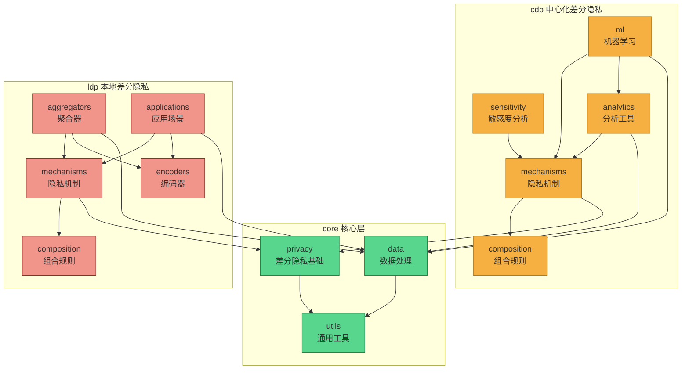
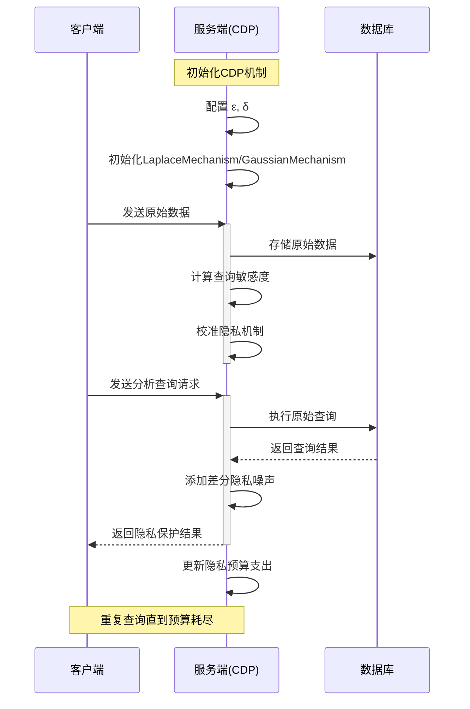
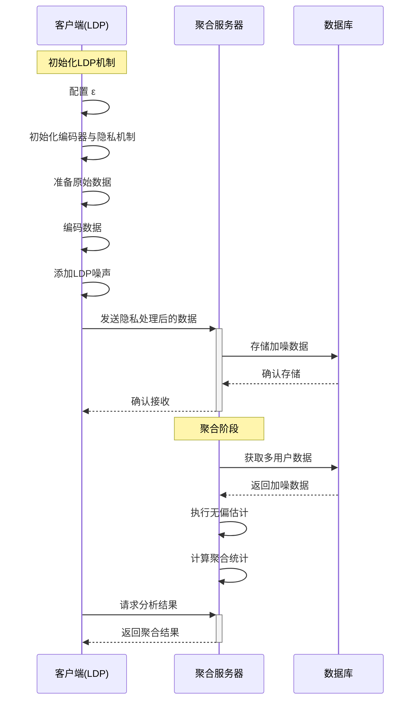
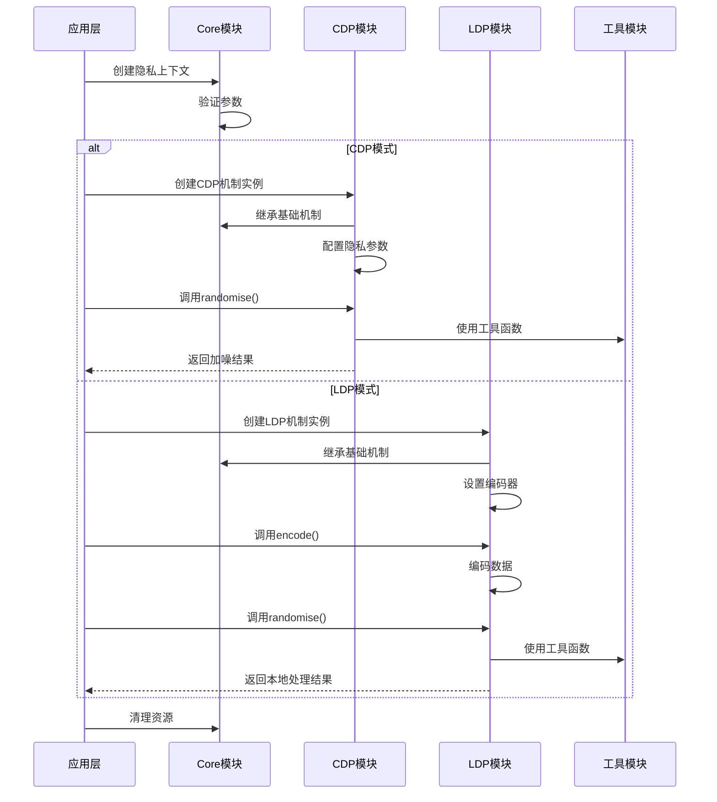

# **NSSDPlib结构设计**
---
## **🎯 总体分层架构图**

```mermaid
graph TD

%% ─────────────── 根目录 ───────────────
A["dplib/<br>统一差分隐私库"]

%% ─────────────── 一级模块 ───────────────
A --> D1["docs/<br>文档模块"]
A --> C1["core/<br>核心框架"]
A --> C2["cdp/<br>中心化差分隐私模块"]
A --> C3["ldp/<br>本地差分隐私模块"]
A --> T1["tests/<br>测试模块"]
A --> E1["examples/<br>使用示例"]
A --> B1["benchmarks/<br>基准测试"]
A --> N1["notebooks/<br>Jupyter笔记本"]

%% ─────────────── docs（二级） ───────────────
D1 --> D1_1["api/<br>API参考"]
D1 --> D1_2["examples/<br>示例文档"]
D1 --> D1_3["theory/<br>理论背景"]
D1 --> D1_4["development/<br>开发文档"]
D1 --> D1_5["_static/<br>静态资源"]

%% ─────────────── core（二级） ───────────────
C1 --> C1_1["privacy/<br>隐私抽象层"]
C1 --> C1_2["data/<br>数据抽象层"]
C1 --> C1_3["utils/<br>共享工具库"]

%% ─────────────── cdp（二级） ───────────────
C2 --> C2_1["mechanisms/<br>机制实现"]
C2 --> C2_2["composition/<br>组合定理"]
C2 --> C2_3["sensitivity/<br>敏感度分析"]
C2 --> C2_4["ml/<br>机器学习"]
C2 --> C2_5["analytics/<br>分析工具"]

%% ─────────────── ldp（二级） ───────────────
C3 --> C3_1["mechanisms/<br>LDP机制"]
C3 --> C3_2["encoders/<br>编码器"]
C3 --> C3_3["aggregators/<br>聚合器"]
C3 --> C3_4["composition/<br>组合机制"]
C3 --> C3_5["applications/<br>应用场景"]

%% ─────────────── tests（二级） ───────────────
T1 --> T1_1["unit/<br>单元测试"]
T1 --> T1_2["integration/<br>集成测试"]
T1 --> T1_3["property_based/<br>属性测试"]
T1 --> T1_4["performance/<br>性能测试"]
T1 --> T1_5["accuracy/<br>准确性测试"]
T1 --> T1_6["fixtures/<br>测试夹具"]
T1 --> T1_7["regression/<br>回归测试"]

%% ─────────────── examples（二级） ───────────────
E1 --> E1_1["basic/<br>基础示例"]
E1 --> E1_2["cdp_examples/<br>CDP示例"]
E1 --> E1_3["ldp_examples/<br>LDP示例"]
E1 --> E1_4["advanced/<br>高级示例"]

%% ─────────────── benchmarks（二级） ───────────────
B1 --> B1_1["performance/<br>性能基准"]
B1 --> B1_2["accuracy/<br>准确性基准"]
B1 --> B1_3["scalability/<br>可扩展性基准"]

%% ─────────────── notebooks（二级） ───────────────
N1 --> N1_1["tutorials/<br>教程笔记本"]
N1 --> N1_2["demonstrations/<br>演示笔记本"]
N1 --> N1_3["research/<br>研究笔记本"]

%% ─────────────── 样式定义 ───────────────
style A fill:#2E86C1,stroke:#1B4F72,color:#fff

%% docs
style D1 fill:#5DADE2,stroke:#2E86C1
style D1_1 fill:#5DADE2,stroke:#2E86C1
style D1_2 fill:#5DADE2,stroke:#2E86C1
style D1_3 fill:#5DADE2,stroke:#2E86C1
style D1_4 fill:#5DADE2,stroke:#2E86C1
style D1_5 fill:#5DADE2,stroke:#2E86C1

%% core
style C1 fill:#58D68D,stroke:#1E8449
style C1_1 fill:#58D68D,stroke:#1E8449
style C1_2 fill:#58D68D,stroke:#1E8449
style C1_3 fill:#58D68D,stroke:#1E8449

%% cdp
style C2 fill:#F5B041,stroke:#B9770E
style C2_1 fill:#F5B041,stroke:#B9770E
style C2_2 fill:#F5B041,stroke:#B9770E
style C2_3 fill:#F5B041,stroke:#B9770E
style C2_4 fill:#F5B041,stroke:#B9770E
style C2_5 fill:#F5B041,stroke:#B9770E

%% ldp
style C3 fill:#F1948A,stroke:#922B21
style C3_1 fill:#F1948A,stroke:#922B21
style C3_2 fill:#F1948A,stroke:#922B21
style C3_3 fill:#F1948A,stroke:#922B21
style C3_4 fill:#F1948A,stroke:#922B21
style C3_5 fill:#F1948A,stroke:#922B21

%% tests
style T1 fill:#BB8FCE,stroke:#633974
style T1_1 fill:#BB8FCE,stroke:#633974
style T1_2 fill:#BB8FCE,stroke:#633974
style T1_3 fill:#BB8FCE,stroke:#633974
style T1_4 fill:#BB8FCE,stroke:#633974
style T1_5 fill:#BB8FCE,stroke:#633974
style T1_6 fill:#BB8FCE,stroke:#633974
style T1_7 fill:#BB8FCE,stroke:#633974

%% examples
style E1 fill:#F7DC6F,stroke:#B7950B
style E1_1 fill:#F7DC6F,stroke:#B7950B
style E1_2 fill:#F7DC6F,stroke:#B7950B
style E1_3 fill:#F7DC6F,stroke:#B7950B
style E1_4 fill:#F7DC6F,stroke:#B7950B

%% benchmarks
style B1 fill:#85C1E9,stroke:#2874A6
style B1_1 fill:#85C1E9,stroke:#2874A6
style B1_2 fill:#85C1E9,stroke:#2874A6
style B1_3 fill:#85C1E9,stroke:#2874A6

%% notebooks
style N1 fill:#7FB3D5,stroke:#1F618D
style N1_1 fill:#7FB3D5,stroke:#1F618D
style N1_2 fill:#7FB3D5,stroke:#1F618D
style N1_3 fill:#7FB3D5,stroke:#1F618D
```

---

## **🧭 模块概览**

| **🧩模块/**             | **核心职责**                     |
| :---------------- | :------------------------------ |
| **`📘docs/`**       | 提供完整的项目文档、API参考、理论说明与开发指南。      |
| **`⚙️core/`**       | 定义通用抽象层与工具函数，是 CDP 与 LDP 的共同基础。 |
| **`🔵cdp/`**        | 实现中心化差分隐私算法与机制，用于可信服务器端的数据保护。   |
| **`🟢ldp/`**        | 实现本地差分隐私算法与应用，使用户数据在上传前即被保护。    |
| **`🧪tests/`**      | 提供全面的单元、集成与性能测试，保障库的稳定与正确性。     |
| **`💡examples/`**   | 包含从入门到高级的使用示例，展示典型差分隐私应用。       |
| **`📊benchmarks/`** | 评估不同机制在性能、准确性和可扩展性方面的表现。        |
| **`📓notebooks/`**  | 提供交互式 Jupyter 笔记本，用于实验、教学与算法演示。 |
| **`🧬hybrid/`**     | 混合模式（待扩展）                |

---

## **🔄 模块边界与依赖关系**

### **📝 依赖规则说明**

1. **层次依赖原则**
   - core 层为基础设施，不依赖其他模块
   - cdp 和 ldp 可依赖 core 层组件
   - cdp 和 ldp 之间禁止直接依赖

2. **模块内部规则**
   - mechanisms 为基础组件，其他组件可以依赖它
   - composition 被 mechanisms 使用，处理隐私预算
   - analytics/ml 可以使用 mechanisms 实现分析功能
   - applications 可以使用本模块内的所有组件

3. **数据流原则**
   - 所有数据处理优先通过 core.data 提供的接口
   - 避免在 cdp/ldp 中重复实现数据处理逻辑
   - 确保数据转换的一致性和可追踪性

4. **工具使用原则**
   - 通用工具函数统一放在 core.utils
   - 特定领域工具放在对应模块中
   - 避免跨模块调用工具函数

### **🔭 设计目标**

1. **可扩展性**
   - 新机制通过继承 BaseMechanism 轻松添加
   - 新的分析方法可在各自模块中独立开发
   - 支持在不修改核心代码的情况下扩展功能

2. **模块化**
   - 每个子模块职责单一明确
   - 依赖关系清晰，避免循环依赖
   - 便于单元测试和集成测试

3. **可维护性**
   - 清晰的层次结构
   - 最小化跨模块依赖
   - 统一的接口设计
---

## **🔄 数据流与API调用序列**

### **1. CDP模式数据流**

### **2. LDP模式数据流**

### **3. API调用流程**

### **📝 关键交互说明**

1. **CDP模式特点**
   - 原始数据集中存储在服务端
   - 查询时进行差分隐私保护
   - 集中跟踪隐私预算消耗
   - 支持复杂查询和机器学习任务

2. **LDP模式特点**
   - 数据在本地完成隐私处理
   - 服务端只接收隐私保护后的数据
   - 分布式隐私预算管理
   - 适合大规模数据收集场景

3. **API设计原则**
   - 统一的机制接口
   - 灵活的配置选项
   - 清晰的错误处理
   - 链式调用支持

---