```mermaid
graph LR
    %% 阶段节点
    Stage0["阶段 0: 项目准备与架构设计"]
    Stage1["阶段 1: 核心框架开发 (core/)"]
    Stage2["阶段 2: CDP 模块实现 (服务端)"]
    Stage3["阶段 3: LDP 模块实现 (客户端)"]
    Stage4["阶段 4: 模块化安装与包管理"]
    Stage5["阶段 5: 测试与验证"]
    Stage6["阶段 6: 文档、示例与教程"]
    Stage7["阶段 7: 发布与运维"]

    %% 阶段顺序
    Stage0 --> Stage1
    Stage1 --> Stage2
    Stage1 --> Stage3
    Stage2 --> Stage4
    Stage3 --> Stage4
    Stage4 --> Stage5
    Stage5 --> Stage6
    Stage6 --> Stage7

    %% 样式
    classDef stage0 fill:#FFB6C1,stroke:#333,stroke-width:1px,color:#333;
    classDef stage1 fill:#FFD700,stroke:#333,stroke-width:1px,color:#333;
    classDef stage2 fill:#1E90FF,stroke:#333,stroke-width:1px,color:#fff;
    classDef stage3 fill:#32CD32,stroke:#333,stroke-width:1px,color:#fff;
    classDef stage4 fill:#FFA500,stroke:#333,stroke-width:1px,color:#333;
    classDef stage5 fill:#8A2BE2,stroke:#333,stroke-width:1px,color:#fff;
    classDef stage6 fill:#00CED1,stroke:#333,stroke-width:1px,color:#333;
    classDef stage7 fill:#FF4500,stroke:#333,stroke-width:1px,color:#fff;

    class Stage0 stage0;
    class Stage1 stage1;
    class Stage2 stage2;
    class Stage3 stage3;
    class Stage4 stage4;
    class Stage5 stage5;
    class Stage6 stage6;
    class Stage7 stage7;
```

# **开发落地总体规划**

---


---

## **上游需求与范围对齐**

- **功能范围（参考 `docs/development/requirements.md`）**：`core/` 需提供 BaseMechanism、PrivacyAccountant、Composition、Domain/Sensitivity 等抽象；`cdp/` 至少实现 Laplace/Gaussian/Exponential/Geometric/Vector 机制、Moments Accountant、DP-SGD 与 mean/sum/histogram 等统计查询；`ldp/` 覆盖 GRR/OUE/OLH/RAPPOR/连续值机制、编码器、聚合器与典型应用示例，并提供各自的端到端示范。
- **非功能指标**：单次标量机制 < 1 ms、1e3 维向量 < 500 ms、DP-SGD 支持 1e6 样本且性能 ≥ OpenDP 0.9×、1000 用户 LDP 聚合 < 2 s；兼容 Python 3.9~3.13、Linux/macOS/Windows，构建体系为 `setuptools + pyproject.toml`，文档采用 Sphinx + ReadTheDocs 风格。
- **关键约束**：wheel ≤ 30 MB、统一使用 `numpy.random.Generator`、默认全局敏感度模型（局部敏感度需显式声明）、隐私预算需满足 ε ≤ 2.0/δ ≤ 1e-5、所有测试以 Python 3.11 为基准通过。
- **MVP 交付边界**：产出可本地安装的 `dplib-core`/`dplib-cdp`/`dplib-ldp` 多包方案，与 `docs/development/directory_layout.md` 描述的源码/文档/测试结构保持一致，并覆盖至少一条 CDP 与 LDP 端到端演示链路。

---

## **关键里程碑与交付物对应**

| 阶段 | 核心交付 | 关联文档 | 验收要点 |
| ---- | -------- | -------- | -------- |
| 0 | 需求基线、架构蓝图、CI 策略 | `requirements.md` `architecture.md` `tech_stack.md` | 需求冻结、Mermaid 架构图更新、CI 方案评审通过 |
| 1 | `core/` 抽象层与基础测试 | `api_contracts.md` `directory_layout.md` | 机制基类/隐私会计/数据域实现，核心 UT 覆盖 ≥80% |
| 2 | CDP 服务端能力与基准 | `requirements.md` `architecture.md` | 噪声机制/组合/DP-SGD/analytics 完成，性能基准入库 |
| 3 | LDP 客户端能力与轻量打包 | `requirements.md` `api_contracts.md` | LDP 机制/编码/聚合/应用示例完成，客户端包 < 10 MB |
| 4 | 模块化安装方案 | `tech_stack.md` | `pyproject.toml` extras/多 wheel 验证、依赖拓扑清晰 |
| 5 | 测试与验证体系 | `requirements.md` `architecture.md` | 单元+集成+属性+性能测试矩阵落地，CI 绿灯 |
| 6 | 文档与示例 | `directory_layout.md` | Sphinx 构建通过、示例/教程与 API 保持一致 |
| 7 | 发布与运维 | `tech_stack.md` | PyPI/私有仓库发布、自动化流水线、监控/反馈闭环 |

---

## **跨阶段依赖与资源准备**

- 遵循 `docs/development/directory_layout.md` 约定的目录结构，提前为 `tests/`、`examples/`、`benchmarks/`、`notebooks/` 预留空间。
- 统一技术栈（`docs/development/tech_stack.md`）：Python 3.9~3.13 + `pip install -e .[dev]`，CI 运行 `pytest/pytest-cov/black/isort/flake8/mypy/safety`。
- 机制实现需满足 `docs/development/api_contracts.md` 的方法约束、序列化协议与异常模型，保持客户端/服务端一致的调用链。
- 阶段切换必须提交评审纪要，确保需求、设计、实现、验证 artifact 保持同步。

---

## **阶段 0：项目准备与架构设计**

**目标**：明确整体架构、模块边界、客户端/服务端分离策略和安装方式。

**产出**
- 项目需求文档（功能、性能、模块化安装需求）
- 架构图（core/cdp/ldp 分层 + 客户端/服务端接口）
- 模块依赖与责任矩阵（dplib-core/dplib-cdp/dplib-ldp）
- 开发规范、版本管理策略、CI/CD 流水线方案

**注意事项**
- 明确核心模块 `core/` 为所有模块公用依赖
- 确定客户端轻量化需求，只安装 `dplib-ldp` + `dplib-core`
- 服务端安装 `dplib-cdp` + `dplib-core`，可选择接入客户端数据

**任务拆解（与 `architecture.md`、`tech_stack.md` 对齐）**
- 将 `requirements.md` 功能/非功能映射到 core/CDP/LDP 分层，形成责任矩阵。
- 明确数据流与部署拓扑（JSON/Protobuf/REST），在 `architecture.md` 中标注接口与预算跟踪点。
- 给出 Python × OS × 可选依赖的 CI/测试矩阵，并锁定工具链。
- 定义随机数、隐私预算、敏感度策略与外部依赖评估准则。
- 配置 `pre-commit` 钩子集成 `black`/`isort`/`flake8`/`mypy` 自动格式化与静态检查，团队执行 `pre-commit install` 作为提交前默认流程。

**验收标准**
- 架构评审纪要覆盖组件边界、数据流、部署模型，并记录在 `architecture.md`。
- README/贡献指南同步版本策略、CI 工具链与编码规范。
- 需求基线冻结（含变更流程与审批责任人）。

**风险与依赖**
- 需求漂移：建立双周审阅节奏，必要时回滚阶段 0。
- 性能目标不清：提前确认基准环境、数据集与负责人。

---

## **阶段 1：核心框架开发（core/）**

**目标**：实现核心基础设施，支持所有子模块依赖。

**产出**
- `core/privacy/`：机制基类、隐私会计器、组合定理接口、预算管理
- `core/data/`：数据域、数据集、敏感度计算、数据验证
- `core/utils/`：数学工具、随机数、配置、序列化、日志、性能监控
- 核心单元测试与 CI 任务

**注意事项**
- 保证接口通用，CDP 和 LDP 可以继承和复用
- 核心模块保持精简，避免引入大型 ML 依赖
- 提供工厂模式与注册表，便于模块化安装

**任务拆解（遵循 `api_contracts.md`）**
- 实现 `BaseMechanism`、`PrivacyAccountant`、`Composition`、`Domain/Sensitivity` 等抽象与异常体系。
- 完成 `core/utils` 中 math/random/config/logging/performance 的最小实现，支撑噪声计算与监控。
- 设计 `mechanism_factory` 与注册表，提供配置化构建能力。
- 构建 `pytest` 夹具、覆盖率收集（≥80%），并在 CI 中接入 black/flake8/isort/mypy。

**验收标准**
- `core/` 相关测试通过，覆盖率 ≥80%。
- 机制基类满足 `api_contracts.md` 中 calibrate/randomise/serialize 行为。
- `dplib-core` wheel < 5 MB，默认安装无重型依赖。

**风险与依赖**
- 数据抽象与 LDP 需求冲突：通过接口适配层缓冲。
- 数值/类型问题：引入 `mypy`、`hypothesis` 及早验证。

---

## **阶段 2：CDP 模块实现（服务器端）**

**目标**：实现中心化差分隐私模块，面向服务器端部署。

**产出**
- `cdp/mechanisms/`：拉普拉斯、高斯、指数、几何、阶梯、向量机制与工厂
- `cdp/composition/`：基本/高级组合、Moments Accountant、预算调度
- `cdp/sensitivity/`：敏感度分析工具、噪声校准
- `cdp/ml/`：DP-SGD、目标扰动、输出扰动等 ML 支持
- `cdp/analytics/`：隐私查询、合成数据、报告生成与基准脚本

**注意事项**
- 仅依赖 `dplib-core`，避免将客户端依赖打包进服务器端
- 支持接收客户端 LDP 加噪数据进行聚合或分析
- ML 依赖以可选 extras 提供

**任务拆解（结合 `requirements.md` 性能指标）**
- 完成多种噪声机制实现与注册，覆盖 scalar/vector/streaming 场景。
- 实现高级组合（Moments Accountant、RDP、zCDP）与隐私预算跟踪 API。
- 集成 DP-SGD、线性模型等训练流程，提供 `examples/cdp` 与 notebook。
- 在 `benchmarks/performance` 中建立噪声与训练基准，记录目标指标。

**验收标准**
- 单次噪声生成 < 1 ms、DP-SGD ≥ OpenDP 0.9× 的基准数据存档。
- `cdp/` 单元与集成测试覆盖 ≥85%。
- `pip install "dplib-cdp[ml]"` 仅按需拉取 torch/scikit-learn。

**风险与依赖**
- 可选依赖冲突：通过 `extras_require` + `pip constraints` 管控。
- 性能未达标：准备 Cython/Numba/批处理方案兜底。

---

## **阶段 3：LDP 模块实现（客户端）**

**目标**：实现本地差分隐私模块，面向客户端部署，突出轻量化。

**产出**
- `ldp/mechanisms/`：GRR、OUE、OLH、RAPPOR、连续值机制
- `ldp/encoders/`：分类/数值/哈希/Sketch/Bloom Filter 编码器
- `ldp/aggregators/`：频率、均值、方差、分位数估计器
- `ldp/applications/`：频繁项、范围查询、键值统计示例
- 端到端示例与客户端基准测试

**注意事项**
- 保持包体积小，避免引入 heavy ML 依赖
- 接口输出加噪数据，服务端可直接聚合
- 提供 JSON/Protobuf 等轻量序列化能力

**任务拆解（结合 `api_contracts.md` 客户端约束）**
- 实现多种机制并区分 `encode()` 与 `randomise()` 生命周期，确保校准校验。
- `encoders` 输出元数据（domain/hash seeds）供服务端解析。
- 构建聚合器与 `ldp/applications`，覆盖 heavy hitters、range query 等典型场景。
- 设计 `examples/ldp` 与 notebook，演示端到端数据上传流程。

**验收标准**
- `dplib-ldp` wheel < 10 MB，1000 用户聚合 < 2 s。
- LDP API 行为与 `api_contracts.md` 对齐（未校准拒绝 randomise 等）。
- 客户端示例/基准可复现，输出误差/效用报告。

**风险与依赖**
- 参数/配置爆炸：提供模板化配置与自动校验。
- 序列化分裂：定义 JSON schema，protobuf 作为扩展选项。

---

## **阶段 4：模块化安装与包管理**

**目标**：实现按模块安装，支持客户端/服务端独立部署。

**产出**
- `dplib-core`/`dplib-cdp`/`dplib-ldp` 拆包方案
- `pyproject.toml`/`setup.cfg` extras 配置（`[ml]`, `[docs]`, `[dev]` 等）
- 构建/发布脚本与安装矩阵文档

```bash
# 核心模块
pip install dplib-core

# 服务端（含可选 ML 依赖）
pip install "dplib-cdp[ml]"

# 客户端轻量安装
pip install dplib-ldp
```

**注意事项**
- 保证 core/cdp/ldp 依赖关系清晰，避免循环依赖
- 控制客户端包体积与依赖数量
- 文档中同步模块化安装说明

**任务拆解**
- 在构建脚本中生成多 wheel + `sdist`，并在 CI 中执行安装冒烟测试。
- 使用 `pipdeptree`/`pip install --dry-run` 检查依赖冲突与可选依赖覆盖面。
- 更新 `docs/installation.rst` 与 FAQ，覆盖常见安装/升级问题。

**验收标准**
- `python -m build` 产物满足体积/依赖约束。
- `pip install dplib-cdp` 自动拉取 `dplib-core`，`dplib-ldp` 无多余依赖。
- 安装矩阵文档发布并通过内部演练。

**风险与依赖**
- 多平台构建差异：CI 增加 Windows/macOS 构建任务。
- Extras 循环依赖：持续运行依赖检测任务。

---

## **阶段 5：测试与验证**

**目标**：保证模块正确性、隐私性和性能，支持分离部署。

**产出**
- 单元测试覆盖 core/CDP/LDP
- 集成测试：客户端 LDP → 服务端 CDP → 报告
- 属性测试：隐私属性、组合属性、机制约束
- 性能/基准测试：噪声生成、聚合、DP-SGD
- 回归测试策略与报告

**注意事项**
- 模拟客户端发送 LDP 数据到服务端流水线
- 验证整体 ε-budget、准确性和效用
- 保证客户端轻量部署下性能可接受

**任务拆解**
- 规划 `tests/unit`、`tests/integration`、`tests/property_based`、`tests/performance` 分层套件。
- 引入 `hypothesis`/统计检验，对 ε/δ 上界进行属性验证。
- 在 CI 中运行端到端流水线测试与最小性能冒烟；完整基准在 nightly job 执行。
- 将性能/隐私报告写入 `benchmarks/` 并自动上传到仓库 Wiki/Artifacts。

**验收标准**
- 语句覆盖率 ≥90%，core/cdp/ldp 关键模块 ≥95%。
- 属性测试误差 ≤ 1e-5，组合测试结果与理论一致。
- 性能基准达到 `requirements.md` 指标，报告可追溯。

**风险与依赖**
- 基准耗时导致 CI 拖慢：拆分 PR 快速任务与 nightly 全量任务。
- 随机性导致测试波动：固定 RNG 种子并提供重现脚本。

---

## **阶段 6：文档、示例与教程**

**目标**：提供完整文档、示例和教程，指导模块化安装和客户端/服务端部署。

**产出**
- 文档：安装指南、API 参考、理论背景、开发者指南
- 示例：客户端加噪、服务端聚合、CDP/LDP 结合案例
- Jupyter 笔记本：模块安装、端到端演示、隐私预算·效用分析

**注意事项**
- 明确标注客户端/服务端能力边界
- 提供隐私预算计算与效用评估示例

**任务拆解**
- 按 `directory_layout.md` 补齐 `docs/overview/installation/quickstart/tutorials/api/theory/development`。
- 使用 autodoc + 手写指南输出 `core/cdp/ldp` API，附示例代码与参数说明。
- 在 `examples/` 与 `notebooks/tutorials` 中实现两条端到端脚本，并为 `nbval`/`pytest --examples` 做好钩子。
- 配置 `sphinx-build -b html` 与（可选）ReadTheDocs，确保构建无警告。

**验收标准**
- 文档构建 0 warning，示例/笔记本可自动校验。
- 快速开始覆盖安装、最小示例、隐私预算报告导出，全程 < 5 分钟。
- 教程中包含性能/隐私折衷分析与可视化。

**风险与依赖**
- 文档滞后于代码：建立 API 变更 checklist，合并前必须更新文档。
- 笔记本依赖沉重：拆分 `requirements-docs.txt` 与 `requirements-notebooks.txt`。

---

## **阶段 7：发布与运维**

**目标**：上线模块化库，支持客户端/服务端独立部署和升级。

**产出**
- PyPI/私有仓库发布包：`dplib-core`, `dplib-cdp`, `dplib-ldp`
- CI/CD 自动化测试与文档构建流水线
- 性能/准确性基准数据与运维手册
- Bug 修复流程与版本管理（SemVer + LTS）

**注意事项**
- 发布前通过隐私属性测试和回归测试
- 保证客户端/服务端模块独立升级不破坏接口
- 监控性能、日志、隐私预算消耗情况

**任务拆解**
- 建立 release pipeline：自动 bump 版本、构建 wheel、上传 PyPI/私有仓库、生成 Release Notes。
- 配置运行时监控（性能、预算、错误率）与告警流程，输出运维 runbook。
- 制定缺陷响应 SLA、版本支持策略，并同步到贡献指南。

**验收标准**
- v0.1.0 发布完成，CI Release Job 全绿、产物可复现。
- 运维 runbook 覆盖部署、日志、预算耗尽处理与密钥轮换。
- 发布后两周完成一期回顾，形成后续 backlog。

**风险与依赖**
- 发布流程复杂：设置 dry-run 与清单，必要时分阶段灰度。
- 安全/合规要求：强制运行 `safety`/`pip-audit`，并记录证据。

---

## **总体时间预计**

| 阶段 | 时间周期 | 关键依赖 / 出口条件 |
| ---- | ------ | ----------------- |
| 0 | 1-2 周 | 需求/架构评审通过，CI 策略与目录结构冻结 |
| 1 | 3-4 周 | `core/` UT ≥80%，API 契约签字，wheel 体积合格 |
| 2 | 4-6 周 | 基准测试达标，CDP API + 示例通过验收 |
| 3 | 4-6 周 | LDP 机制/编码/聚合完成，客户端包体积 & 性能达标 |
| 4 | 1-2 周 | 多 wheel 构建通过，安装矩阵文档发布 |
| 5 | 3-4 周 | 覆盖率 ≥90%，属性/性能测试通过，CI 绿灯 |
| 6 | 2-3 周 | Sphinx 构建 0 warning，示例/教程可复现 |
| 7 | 持续 | PyPI 发布 + 运维准备完成，反馈循环建立 |

---

## **滚动评审与节奏**

- **双周评审**：阶段负责人汇报进展、风险、依赖，重大需求变更回溯至阶段 0/1。
- **里程碑 Gate**：出口需附评审纪要、覆盖率/性能/文档等佐证材料方可进入下一阶段。
- **度量看板**：持续跟踪性能、预算、测试、缺陷指标，与 `benchmarks/` 与 CI 日志联动，作为运维与下一版本规划输入。

---
